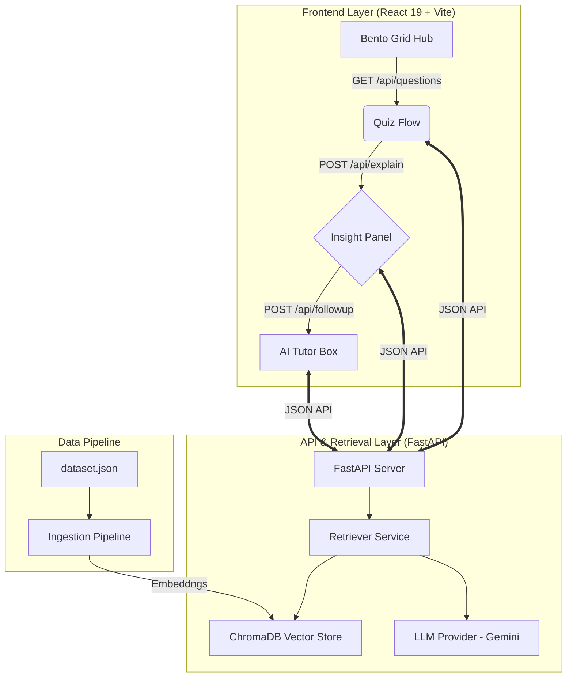

# RAG-Powered Intelligent Quiz Platform

An immersive, AI-driven learning experience that leverages **Retrieval-Augmented Generation (RAG)** to provide grounded, explainable insights. The platform features a cutting-edge **2026 Spatial UI** with 3D interactions and real-time knowledge retrieval.

---

## 🚀 Overview

This platform is more than just a quiz app—it's a full retrieval-backed educational tool. It intelligently fetches context from a vast knowledge base to explain not just *if* you were right, but *why* you were right, using live evidence from indexed documents.

### Key Features
- **Intelligent RAG Loop**: Real-time semantic search to provide grounded explanations.
- **Explainable AI**: Confidence scoring, context citations, and adaptive feedback.
- **Follow-up AI Tutor**: An integrated chat interface to ask deep questions about quiz answers.
- **Adaptive Domains**: Dynamic question shuffling and domain-specific knowledge banks.
- **Resilient Fallbacks**: Hybrid architecture that functions smoothly even during API outages.

---

## 🛠️ Architecture (Working Diagram)

The system is split into three main layers: the **Creative Frontend**, the **Analytical API**, and the **Vector Pipeline**.



---

## 🎨 Design Philosophy (2026 Spatial UI)

The platform implements a premium, immersive aesthetic designed for high-end engagement:

1.  **Bento Grid Hub**: An asymmetric layout for domain selection that gives visual weight to popular and adaptive subject areas.
2.  **Glassmorphism 2.0**: High-refraction frosted panels using `backdrop-blur-2xl` and sharp 1px top-edge borders to define spatial hierarchy.
3.  **Spatial Depth (Z-Axis)**: A deep dark mode base (`#0a0a0b`) with floating, slow-moving **Mesh Gradient Orbs** that create a living AI atmosphere.
4.  **3D Tactile Interactions**: Localized 3D tilt effects on hover and "squishy" spring-based button physics using **Framer Motion**.
5.  **RAG UX Cues**: Edge-glowing shimmers for thinking states and **Typewriter Streaming** for AI-generated explanations to mimic real-time thought processing.

---

## 💻 Tech Stack

### Frontend
- **React 19**: Modern UI component architecture.
- **Framer Motion**: High-fidelity 3D animations and spring physics.
- **Tailwind CSS v4**: Modern, CSS-first design tokens and utilities.
- **Vite**: Ultra-fast build tool and development server.
- **Lucide React**: Clean, semantic iconography.

### Backend & AI
- **FastAPI**: Asynchronous Python web framework.
- **ChromaDB**: Native AI vector database for semantic retrieval.
- **Google Gemini API**: Advanced LLM (Flash 2.5) for reasoning and generation.
- **Sentence-Transformers**: Local fallback embedding strategies.
- **Uvicorn**: High-performance ASGI server.

---

## 📦 Getting Started

### Prerequisites
- **Node.js**: v18.0 or higher
- **Python**: v3.9 or higher
- **API Key**: A Google AI (Gemini) API Key for RAG generation.

### Installation

1.  **Clone the Repository** (or navigate to the project folder).
2.  **Setup Backend**:
    ```bash
    pip install -r requirements.txt
    ```
3.  **Setup Frontend**:
    ```bash
    npm install
    ```
4.  **Create Environment Variables**:
    Create a `.env` file in the root directory:
    ```env
    GOOGLE_API_KEY=your_gemini_api_key_here
    VITE_API_BASE_URL=http://127.0.0.1:8000
    EMBEDDING_PROVIDER=auto
    ```

---

## 🚀 How to Run

Follow these steps in order to start the full intelligent quiz experience:

### 1. Initialize the Knowledge Base (One-time)
Before running the app, you must ingest the `dataset.json` knowledge source into the vector database:
```bash
python data_pipeline/ingest.py
```

### 2. Start the Backend API
Run the FastAPI server to handle retrieval and explanations:
```bash
uvicorn server.main:app --reload --port 8000
```

### 3. Start the Frontend Application
In a new terminal, launch the Vite development server:
```bash
npm run dev
```

### 4. Access the Platform
Open your browser and navigate to:
**[http://localhost:5173](http://localhost:5173)**

---

## 📁 Project Structure

```text
QUIZ/
├── src/                  # Immersive Frontend components
├── server/               # FastAPI backend logic
├── data_pipeline/        # RAG Logic (Ingest, Retrieve, Embed)
├── chroma_db/            # Local persistent vector storage
├── quiz-datasets/        # Source documents for RAG grounding
└── dataset.json          # Main knowledge source of truth
```
